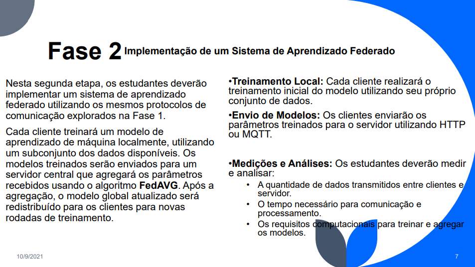
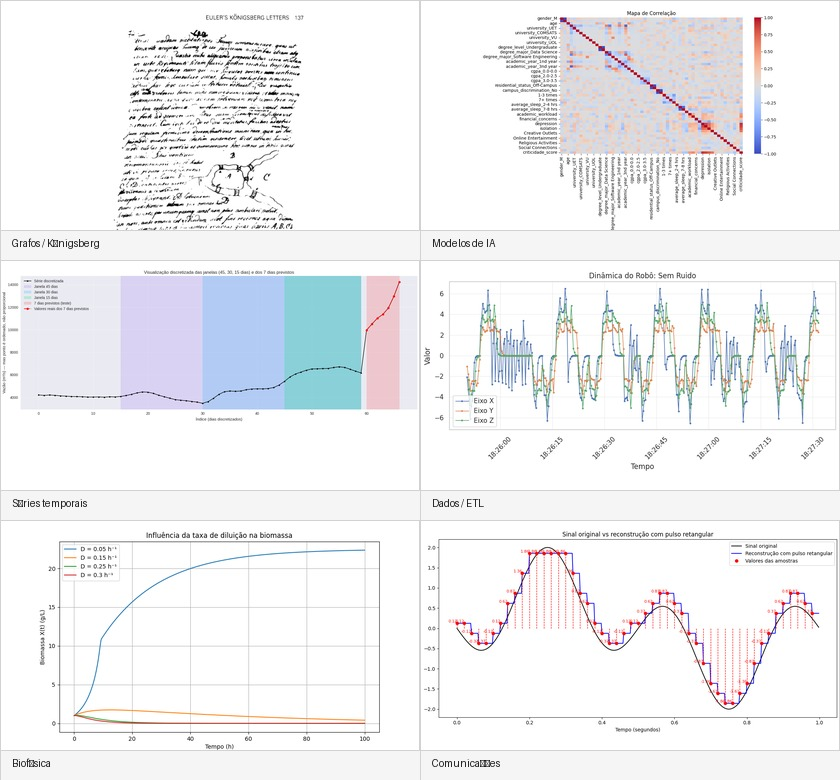

# 👋 Olá, eu sou Vinícius Ribeiro

**Estudante de Engenharia da Computação — UPE/POLI**  
Busco oportunidades de **estágio em desenvolvimento**, com ênfase em **back-end, automação, integrações, sistemas embarcados/IoT, redes e IA aplicada**.

Tenho interesse especial em projetos que misturam software com aplicação prática: APIs, automações, comunicação cliente-servidor, sensores, microcontroladores, dados e sistemas distribuídos.

  
  
  

---

## 🚀 Foco profissional

Atualmente estou organizando meu portfólio para oportunidades de entrada em tecnologia, principalmente em:

- **Desenvolvimento Back-end / APIs** — Python, Node.js, Java, integrações e serviços.
- **Automação e RPA** — scripts, Google APIs, dados, planilhas, processos internos e tarefas repetitivas.
- **IoT e Sistemas Embarcados** — STM32, ESP32, sensores, UART, I²C, SPI, ADC e integração com Python.
- **Redes e Sistemas Distribuídos** — MQTT, cliente-servidor, comunicação entre processos e aprendizado federado.
- **Dados e IA aplicada** — notebooks Python, análise de dados, machine learning e experimentos acadêmicos.

---

## 🧰 Tecnologias e ferramentas

  
  
  
  
  
  
  
  
  
  
  
  

---

## ⭐ Projetos em destaque

### 1. Projeto de Redes 1 — Aprendizado Federado sobre MQTT

Projeto acadêmico de Redes com arquitetura cliente-servidor para simular **aprendizado federado** usando **Python, PyTorch, CIFAR-10 e MQTT**.  
O foco principal foi a comunicação em rede: troca de parâmetros, divisão de dados entre clientes, serialização, envio/recebimento via broker MQTT e coordenação pelo servidor.

  

| Repositório | Papel |
|---|---|
| [federado-server](https://github.com/Projeto-Redes-1/federado-server) | Servidor de aprendizado federado e agregação dos parâmetros |
| [federado-client](https://github.com/Projeto-Redes-1/federado-client) | Cliente participante do treinamento federado |
| [aws-server](https://github.com/Projeto-Redes-1/aws-server) | Versão/experimento de servidor em ambiente AWS |
| [aws-client](https://github.com/Projeto-Redes-1/aws-client) | Versão/experimento de cliente em ambiente AWS |

**Conceitos:** MQTT, PyTorch, CIFAR-10, cliente-servidor, serialização, logs, redes, aprendizado federado.

---

### 2. Imogen — Sistema embarcado para monitoramento portátil

Protótipo com **STM32 NUCLEO-L476RG** para monitorar temperatura e estimar CO em contexto de transporte de material biológico sensível.  
Integra sensores, LCD, UART e backend local em Python/PySerial para registrar medições em CSV.

🔗 [Repositório Imogen](https://github.com/Vjfrib/proj-imogen)

**Conceitos:** STM32, LM75, MQ-7/FC-22, I²C, ADC, UART, LCD 16x2, PySerial, CSV, firmware em C.

---

### 3. Laboratórios STM32 — I²C, SPI, UART, ADC, DAC e periféricos

Conjunto de projetos acadêmicos com **STM32 NUCLEO-L476RG**, explorando comunicação serial, barramentos e periféricos externos.

| Projeto | Destaque |
|---|---|
| [Projeto 4 Embarcados](https://github.com/Vjfrib/proj-4-embarcados) | UART3 com CH340, I²C1, PCF8591, leitura ADC e controle DAC |
| [Projeto 5 Embarcados](https://github.com/Vjfrib/proj-5-embarcados) | Integração de UART, I²C, SPI, PCF8591 e matriz MAX7219 |

**Conceitos:** STM32CubeMX, STM32CubeIDE, HAL, UART, I²C, SPI, callbacks, ADC, DAC, PCF8591, MAX7219.

---

### 4. Comp Calendar — DSL para automação do Google Calendar

Projeto de compiladores com uma linguagem simples para criar, consultar, repetir e deletar eventos no Google Calendar.  
A proposta conecta **ANTLR, Python e Google Calendar API**, demonstrando parsing, interpretação de comandos e integração com API externa.

🔗 [Repositório Comp Calendar](https://github.com/proj-compilers/comp-calendar)

**Conceitos:** ANTLR, gramática, DSL, Python, Google Calendar API, automação, integração de sistemas.

> Observação de segurança: antes de publicar ou divulgar qualquer fork/cópia, revisar credenciais, tokens e arquivos `token.json`/`credentials.json`.

---

### 5. Vaut Python Notebooks — Python, grafos, IA e dados aplicados

Repositório curado com **28 notebooks** desenvolvidos ao longo do curso, reunindo estudos e experimentos em **Python, Estrutura de Dados, grafos, machine learning, análise de dados, biofísica, redes/comunicação e sinais**.

  

🔗 [Repositório Vaut Python Notebooks](https://github.com/Vjfrib/Vaut-Python-Notebooks)

**O que este projeto mostra:**

- Organização e curadoria de notebooks acadêmicos e experimentais.
- Problema das Pontes de Königsberg, grafos e algoritmo de Hierholzer.
- Modelos de machine learning para classificação, regressão e séries temporais.
- Tratamento e visualização de dados com pandas, matplotlib e bibliotecas científicas.
- Experimentos de comunicação, sinais, biofísica e bases biomédicas.
- Links para Colab, assets visuais e documentação em Markdown.

**Conceitos:** Python, Jupyter, pandas, NumPy, matplotlib, scikit-learn, grafos, algoritmos, machine learning, análise exploratória, comunicação e dados biomédicos.

---

### 6. Justa Ionic — app mobile/web com backend Node.js

Protótipo de aplicação com **Ionic/Angular/Capacitor** e backend em **Node.js/Express**, simulando funcionalidades de vendas, recebíveis, usuários e empréstimos.

**Conceitos:** Ionic, Angular, Capacitor, Node.js, Express, rotas REST, JSON, prototipagem mobile/web.

> Link público ainda não definido neste README. Quando o repositório estiver público, adicionar aqui.

---

## 🎮 Projetos de programação, POO e jogos

### Campanha — roguelike em Python

Jogo em estilo roguelike desenvolvido como projeto acadêmico de Fundamentos de Programação.

  

🔗 [Repositório Campanha](https://github.com/JJ-s-Rouguelike/Campanha)

**Conceitos:** Python, lógica de jogo, modularização, menus, mapas, ranking, estruturação de projeto.

---

### Campo Minado — JavaFX e Programação Orientada a Objetos

Projeto acadêmico em Java com interface gráfica usando JavaFX, desenvolvido como prática de Programação Orientada a Objetos.

  

🔗 [Repositório Campo Minado](https://github.com/min-swep-r/jogo)

**Conceitos:** Java, JavaFX, POO, diagrama de classes, eventos, interface gráfica, lógica de jogo.

---

### Logo Turtle — jogo em C

Recriação do jogo Logo Turtle em linguagem C, com foco em programação imperativa, modularização e lógica procedural.

🔗 [Repositório Logo Turtle](https://github.com/Projeto-Logo-Turtle/Codes)

**Conceitos:** C, Code::Blocks, modularização, menus, arquivos `.h/.c`, lógica procedural.

---
